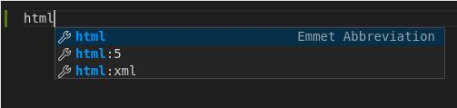

 
 
 
 
 
 
 
 
 
 
 

# HTML/CSS - Opdrachten

## Bart Duisters

 
 
 
 
 
 
 
 
 
 
 
 
 
 
 
 
 
 
 
 
 
 
 
 
 
 
 
 
 
 
 
 
 
 
 
 
 
 
 

# Basis

## Opdracht 1

Wat moet er bovenaan een geldige HTML5-pagina staan?

## Opdracht 2

- Maak een bestand genaamd `basis.html`.
- Voeg de volgende elementen toe:
  - DOCTYPE voor HTML5
  - head
    - title met als inhoud jouw naam
  - body
    - h1 met als inhoud jouw naam

## Opdracht 3

Ga verder op Opdracht 2.

Voeg onder de hoofding een paragraaf toe. In de paragraaf stel je jezelf voor.

## Opdracht 4

Ga verder op Opdracht 3.

Voeg een afbeelding toe, de `src` kan verwijzen naar een lokale afbeelding
aangezien de website enkel lokaal geopend wordt.

## Opdracht 5

Ga verder op Opdracht 4.

Voeg drie links toe naar jouw favoriete websites.

## Opdracht 6

In VSCode is het mogelijk om de basis markup te generen. Maak een nieuw bestand
genaamd `opdracht-6.html`. Open het bestand in VSCode en type `html`.

Er verschijnen `Emmet Abbreviations`, kies voor `html:5` en klik op enter.

# Lijsten en tabellen

**Gebruik vanaf nu VSCode (automatische indentatie, controle van syntax ...) om
HTML te schrijven.**

- Maak een bestand genaamd `lijsten-en-tabellen.html`.
- Gebruik de `html:5`-emmet om de standaard markup te genereren.

## Opdracht 1

Maak een ongeordende lijst van jouw lievelingsdieren. Plaats boven de lijst
een hoofding met als content "Lievelingsdieren".

## Opdracht 2

Er is gevraagd om een layout te voorzien om een recept te tonen.

- Voeg een hoofding toe met als content de naam van het recept.
- Voeg een afbeelding toe onder de hoofding, de afbeelding toont het gerecht
  dat gemaakt zal worden.
- Voeg een hoofding (kleiner dan de hoofding met de naam) toe, met als content
  "Ingrediënten".
- Voeg een ongeordende lijst toe met de benodigde ingrediënten.
- Voeg een hoofding (zelfde grootte als die van "Ingrediënten"), met als content
  "Bereidingswijze".
  Voeg een geordende lijst toe met de stappen om het gerecht te maken.

## Opdracht 3

Maak een tabel met als kolomnamen:

- id
- voornaam
- achternaam
- leeftijd
- geslacht

Maak een tabel met als kolomnamen:

- voornaam
- achternaam
- leeftijd
- geslacht
- docent (dit bevat de id van de docent)

## Opdracht 4

Zorg ervoor dat zowel de voornaam als de achternaam getoond worden onder één
hoofding, met als content "naam".

# CSS

## Opdracht 1

- Maak een HTML-bestand
- In de body, voeg zes `div`-elementen toe
- Style de eerste div zodat het er uitziet als een `h1`-element, maak deze tekst rood
- Style de eerste div zodat het er uitziet als een `h2`-element, maak deze tekst blauw
- Style de eerste div zodat het er uitziet als een `h3`-element, maak deze tekst rood
- Style de eerste div zodat het er uitziet als een `h4`-element, maak deze tekst blauw
- Style de eerste div zodat het er uitziet als een `h5`-element, maak deze tekst rood
- Style de eerste div zodat het er uitziet als een `h6`-element, maak deze tekst blauw

## Opdracht 2

- Maak een HTML-bestand
- Voeg een div toe met als tekst: John Duck
- Voeg `inline css` toe, zorg ervoor dat de tekst van de div in het rood getoond wordt

## Opdracht 3

- Maak een HTML-bestand
- Voeg een div toe met als tekst: John Duck
- Voeg `interne css` toe, zorg ervoor dat de tekst in het rood getoond wordt

## Opdracht 4

- Maak een HTML-bestand
- Voeg een div toe met als tekst: John Duck
  Voeg `externe css` toe, zorg ervoor dat de tekst in het rood getoond wordt (doe dit in een bestand genaamd `styling.css`)

## Opdracht 5

- Maak een HTML-bestand
- Voeg drie div-elementen toe
- Door middel van `externe css` wordt ervoor gezorgd dat
  alle div-elementen een blauwe achtergrond hebben en witte
  tekst
- Door middel van `interne css` wordt ervoor gezorgd dat
  de middelste div, een roze achtergrond heeft en zwarte tekst

Tip: denk aan de verschillende `selectors` (element, class, id)

# Projectstructuur

## Opdracht 1

Als de oefening af is, push deze naar jouw eigen GitHub-repository en stuur de link naar de docent.

Zorg voor een projectstructuur waarbij:

- Alle HTML-pagina's een omschrijvende naam hebben.
- Alle HTML-pagina's de globale stylesheet inladen.
- Zorg voor een map waarin alle `assets` van dit project komen.
- Alle HTML-pagina's een eigen stylesheet inladen (denk aan de volgorde van het inladen). Indien de stylesheet niet bestaat, maak deze aan in de map `css` in de map `assets`.
- Zorg ervoor dat alle pagina's, behalve de hoofdpagina, in een map `pages` zitten.
- Voeg alle afbeeldingen die gebruikt worden doorheen deze oefening toe aan de map `img` in de map `assets`.

De inhoud:

- Alle pagina's:

  - Bovenaan navigatie met links om naar alle pagina's te navigeren.

- Hoofdpagina:

  - Een introductietekst en een foto (bestandsnaam van de foto: selfie.jpg).
  - Wanneer er op de foto geklikt wordt, moet de `about`-pagina geopend worden.

- About-pagina:

  - Tekstje met sporten en hobby's.
  - Een afbeelding (bestandsnaam van de foto: hobby.jpg).

- Projectpagina:

  - Een unordered list met drie projecten waaraan je wilt werken in de toekomst.

De styling:

- Alle pagina's:

  - Tekst (font) om te gebruiken: Lucida Console
  - De grootte van de tekst (font): 16px
  - De grootte van de tekst voor de links in de navigatie: 20px

- Hoofdpagina:

  - Achtergrondkleur: roze
  - Tekstkleur: zwart

- About-pagina:

  - Achtergrondkleur: blauw
  - Tekstkleur: wit

- Projectpagina:
  - Achtergrondkleur: groen
  - Tekstkleur: wit

# JavaScript koppelen

Als er staat 'target het element', dan staat er eigenlijk 'vraag het element op'.
Als er staat 'referentie van element', dan staat er eigenlijk 'de variabele waarin het element is bijgehouden'.

## Opdracht 1

Maak een HTML-pagina (index.html) en koppel een extern JavaScript-bestand (hallo.js).

HTML:
- Plaats een div met id `begroeting`
- Plaats een knop met een `onclick` event handler op de pagina
  - Als er op deze knop geklikt wordt, wordt de functie `veranderTekst()` aangeroepen

JavaScript:
- Target het element met id `begroeting`
- Plaats de tekst `Hallo!` in het element
- Maak een functie `veranderTekst()`, als deze functie uitgevoerd wordt dan:
  - Gebruik de referentie van het element `begroeting` om de tekst te wijzigen naar `Doei!`

## Opdracht 2

Maak een HTML-pagina (index.html) en koppel een extern JavaScript-bestand (bereken.js) en koppel een extern CSS-bestand (style.css).
Indien nodig, voeg `class` of `id` toe op elementen om ze beter te kunnen targetten.

HTML:
- Plaats twee inputs op de pagina (number inputs)
- Plaats een knop op de pagina
  - Als er op de knop geklikt wordt, voer de functie `bereken()` uit
- Plaats een div op de pagina om de uitkomst te tonen

CSS:
- Target de div waarin de uitkomst moet komen, zorg dat de uitkomst blauw getoond wordt en een fontgrootte heeft van 40px

JavaScript:
- Maak de functie genaamd `bereken`:
  - Haal de waarden op van de twee numerieke inputs
  - Toon de som van beide waarden in de div op de HTML-pagina
